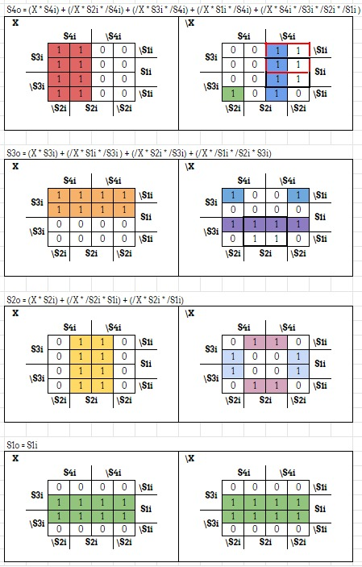
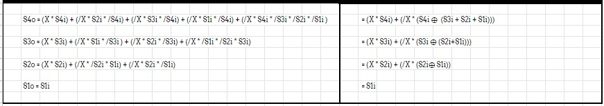
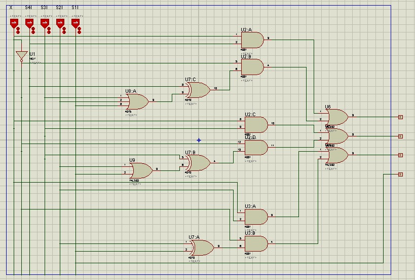

# Two's Compliment - Project 1
This circuit has a toggle who shows a normal binary number or it's two's complement

## Truth Table

## Karnaught Map

## Formula Simplification

## Digital Eletronic Circuits
The toggle is named X and the other buttons are the input for the binary number

