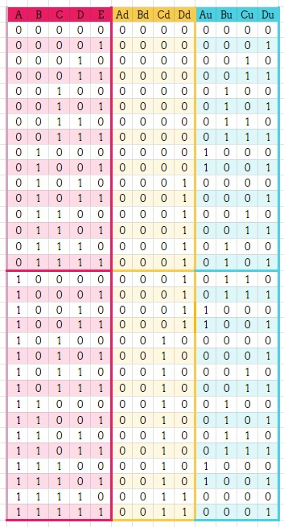
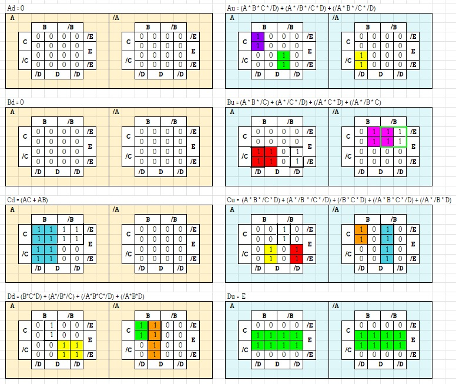
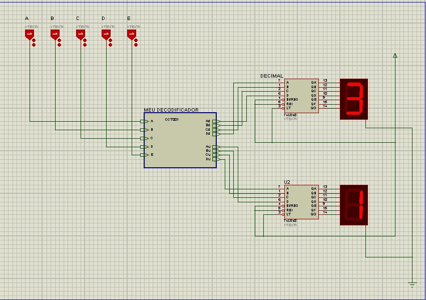

# Seven-segment display - Project 2
This circuit transform a binary number in a decimal number throught 7 led segments

## Truth Table

## Karnaught Map

## Formula Simplification

## Digital Eletronic Circuits
These buttons are the input to the two binary numbers, one that represents the decimal and the other the unit.

