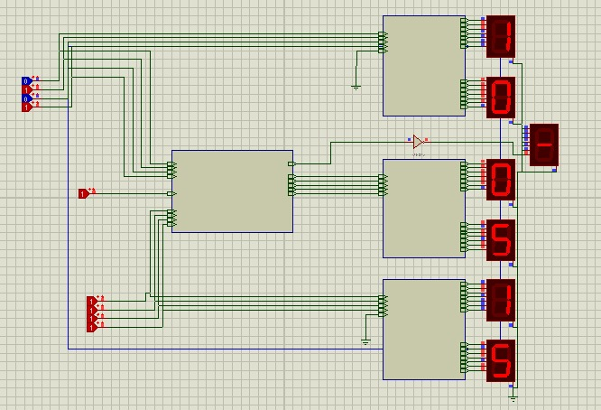

# Seven-segment Display Adder-Subtractor - Project 4
This circuit has an Adder-subtractor who display their results at an seven-segment display.

|           Order            |
|:--------------------------:|
| top number    : first one  |
| middle number : result     |
| bottom number : second one |

|  Operator  |
| :---------:|
|  1 : minus |
|  0 : plus  |

## Digital Eletronic Circuits
The toggle at the middle says what operator gonna be used, the result is displayed at the middle seven segments display and its sign as well.

