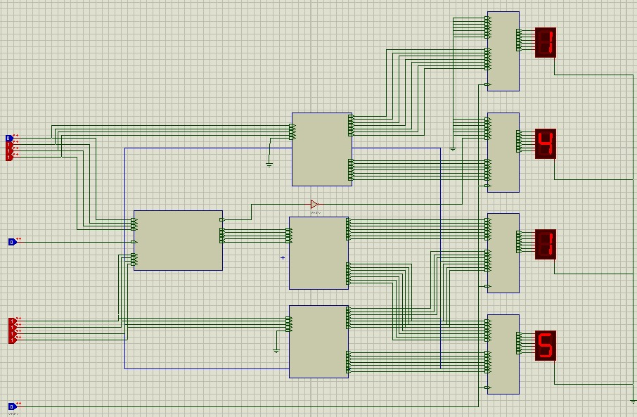

# Multiplexer Seven-segment Display Adder-Subtractor - Project 5
This circuit is equivalent to the fourth project but its has a Multiplexer to show or the operated numbers or the result one.

## Digital Eletronic Circuits
The bottom toggle is the multiplexer's controller.

