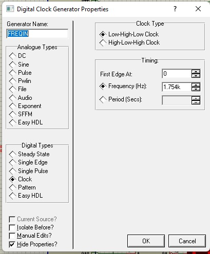
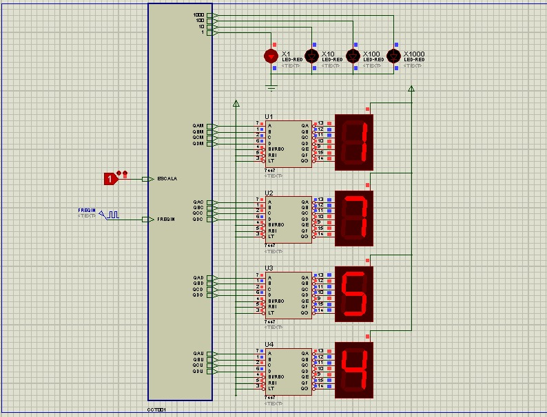
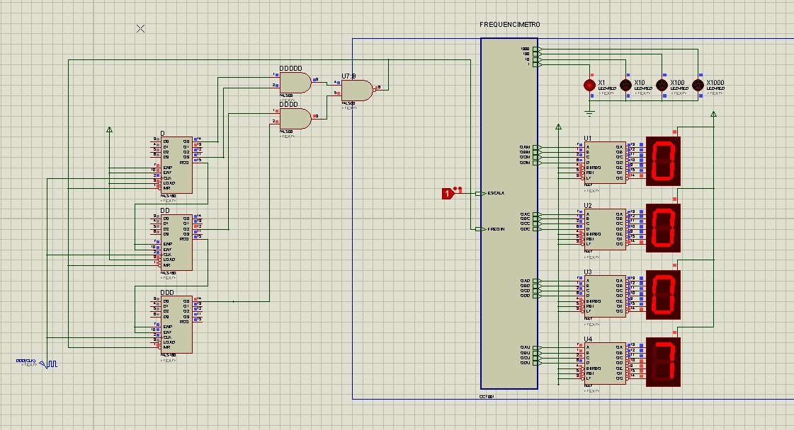
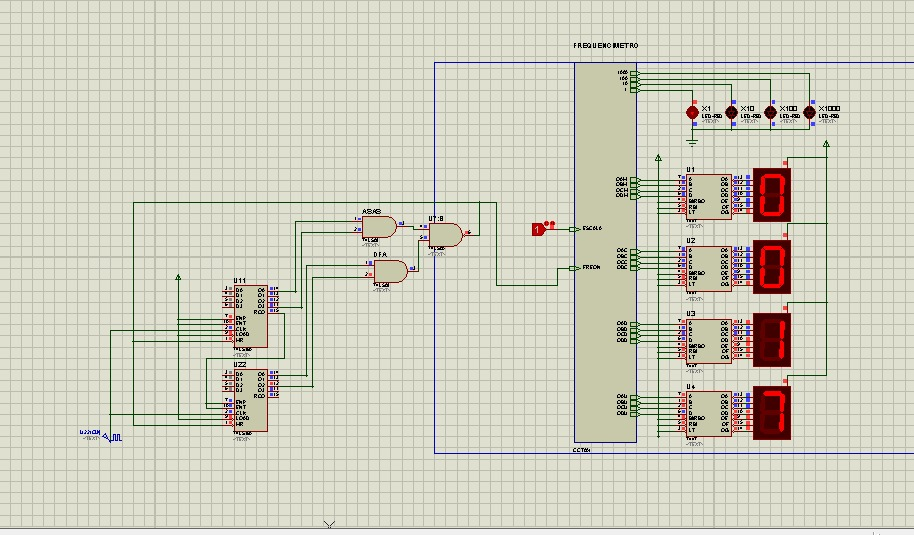

# Frequency Meter - Project 7
This circuit has an input to the frequency do you want to measure and a binary input to change the measuring scale.

## Setup the Circuit

## Digital Eletronic Circuits

## Testing 6,7 Hz Frequency at this circuit

## Testing 17 Hz Frequency at this circuit

