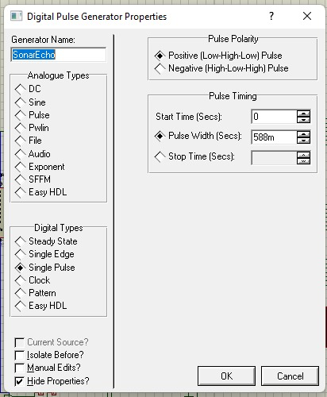
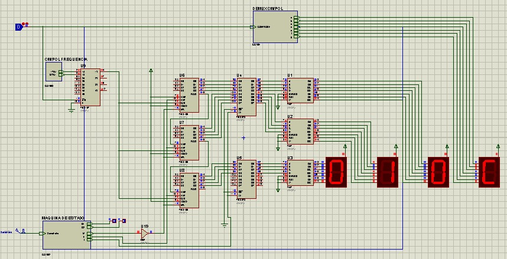
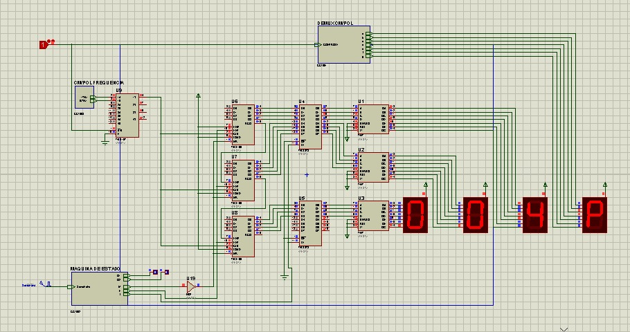

# Digital Ruler - Project 8
This circuit measure the distance in inches or centimeters through a sonar echo.

## Setup the Circuit

## Centimeter Digital Eletronic Circuits
The toggle determine if the measuring is gonna be with centimeters if it's setup to 0.

## Inches Digital Eletronic Circuits
The toggle determine if the measuring is gonna be with inches if it's setup to 1.

