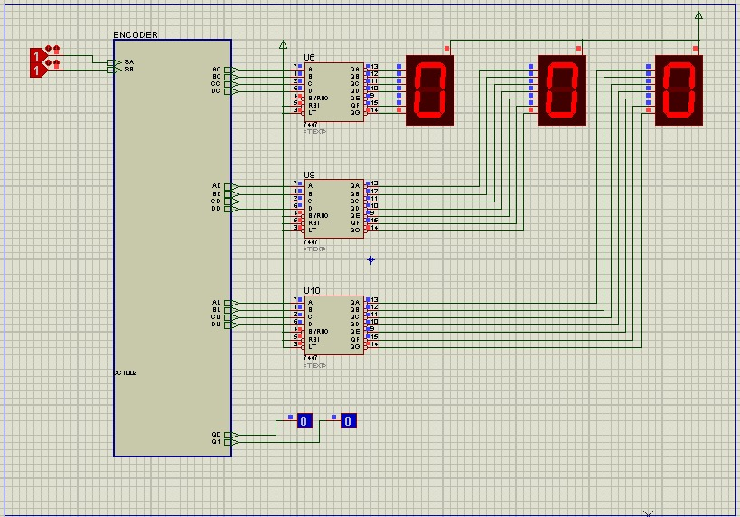
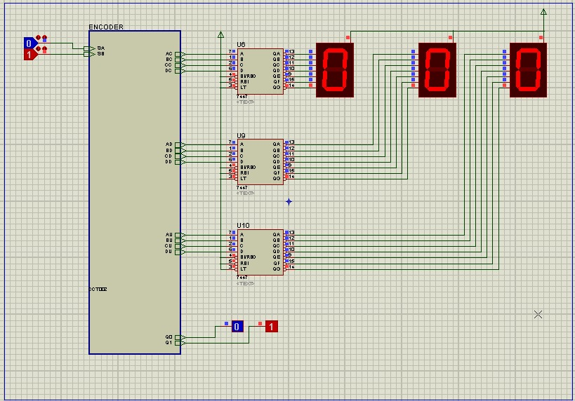
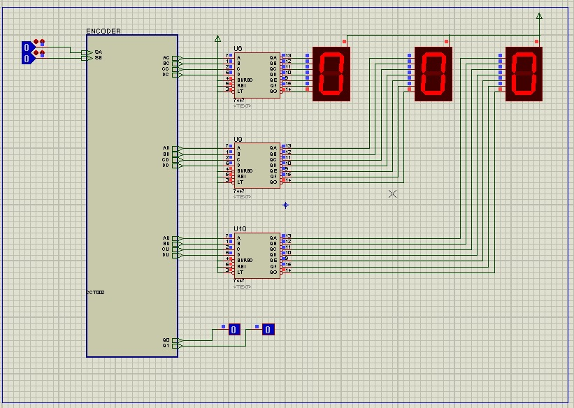
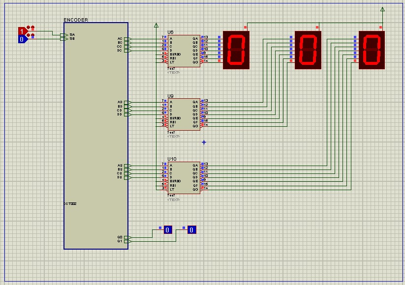
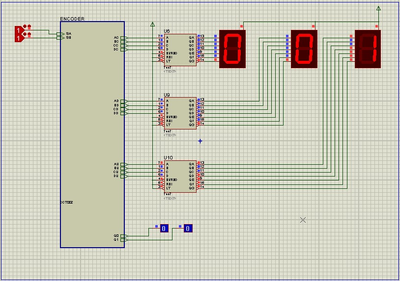

# Object Detector - Project 9
This circuit can detect and count objects passing by it, through two sensors. The sensors are zero activated.

## None sensors where activated

## Only sensor A is activated

## Both sensors where activated

## Only sensor B where activated

## Count object that just passed through

