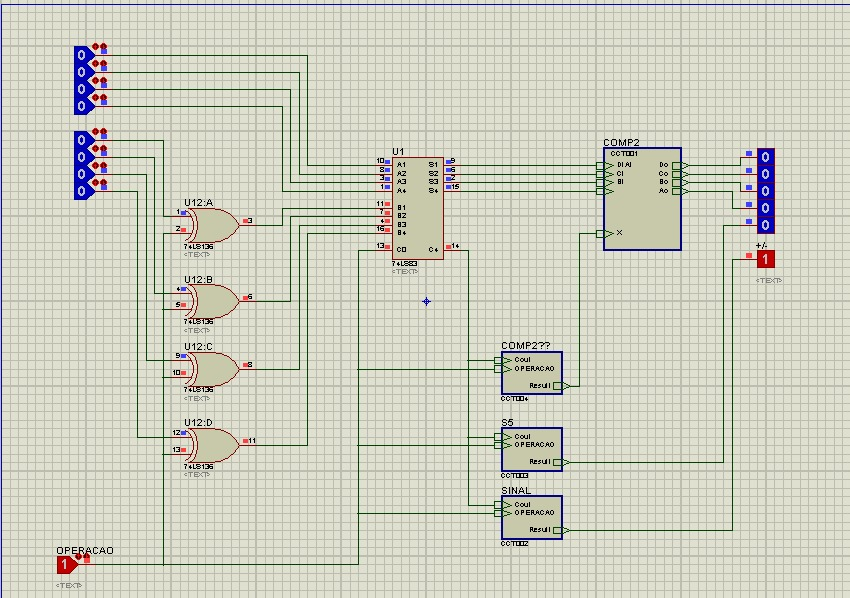

# Adder-Subtractor - Project 3
This circuit has a toggle who adds or subtracts the two binary numbers.
The MSB order is bottom-up where the first one means the binary number sign. 

|      Sign    |           Order            |  Operator  |
| :----------- |:--------------------------:| ----------:|
| 1 : positive | top number    : first one  |  1 : minus |
| 0 : negative | bottom number : second one |  0 : plus  |

## Digital Eletronic Circuits
The OPERACAO entry means the operator toggle, the next 8 bits entrys are for the two binary numbers. The output bits are for the binary result. All of them has a bottom-up MSB order.

