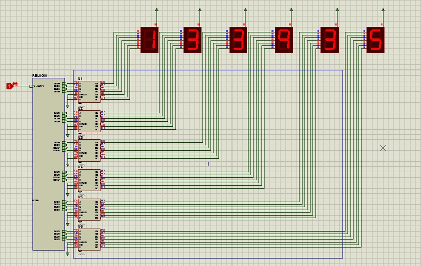

# Adjustable Clock - Project 6
This project has 6 seven-segment display witch each one represents a time digit.

|   1 AND 2   |    3 AND 4    |  5 AND 6 |
| :---------- |:-------------:| --------:|
|     Hour    |     Minute    |  Seconds |

## Digital Eletronic Circuits
The controller toggle increases for a different rhythm everytime its clicked.

